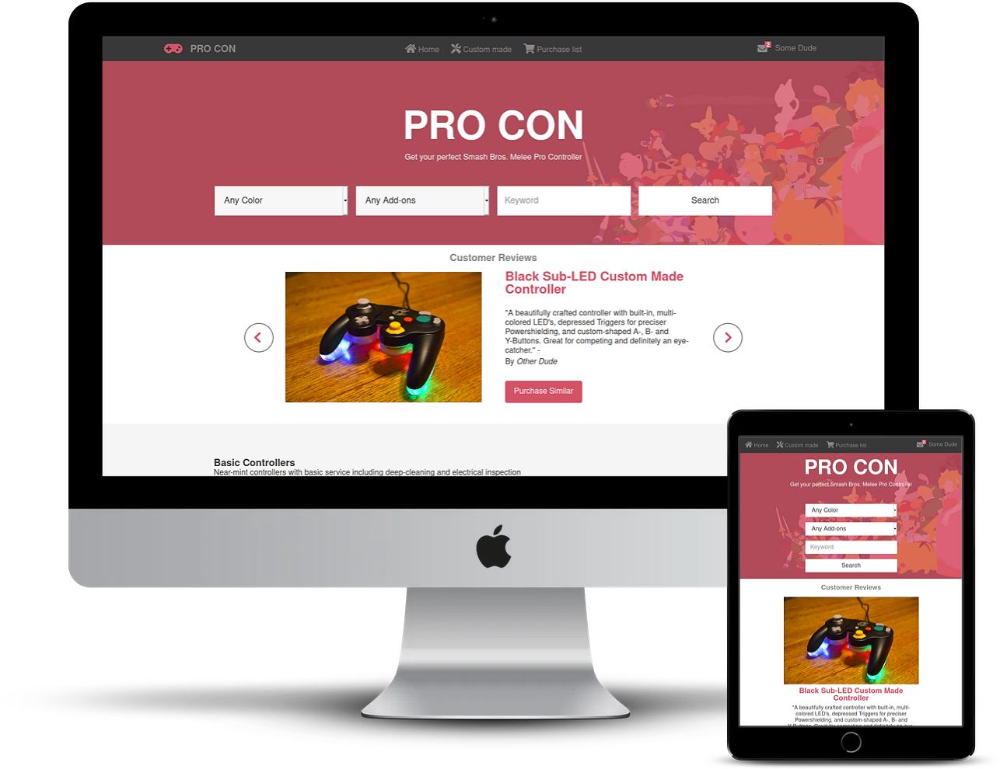

# Capstone Project HTML&CSS - Electronic Shop



An HTML and CSS project of an electronics shop called PRO CON selling gamecube controllers. Flex, Grid, Bootstrap and Animations were used. The site is responsive and has a phone/tablet and a desktop version.

## Video presentation

https://www.loom.com/share/d32dc4fe537b423e86a77ef4f7585635

## Live demo

🔗 [PRO CON website](https://raw.githack.com/marcode95/HTML-CSS-capstone/feature/index.html)
🔗 [PRO CON website search page](https://raw.githack.com/marcode95/HTML-CSS-capstone/feature/search-results.html)

## Built With

- HTML5,
- CSS3,
- Google Fonts,
- Font awesome
- Bootstrap


## Getting Started

To get a local copy up and running follow these simple example steps.

### Prerequisites

Webbrowser and access to internet

### Install

1) [Download](Clone the repository to your machine)

```sh
$ git clone https://github.com/marcode95/HTML-CSS-capstone/tree/feature
```

2) Navigate to the project folder and execute the "index.html" file.

### Usage

Just navigate through the page.

## Authors

👤 **Marco Erhardt**

- Github: [@marcode95](https://github.com/marcode95)


## 🤝 Contributing

Contributions, issues and feature requests are welcome!

Feel free to check the [issues page](issues/).

## Show your support

Give a ⭐️ if you like this project!

## Acknowledgments

All the credits for [design](https://www.behance.net/gallery/24796463/ZATTIX) go to [Mohammed Awad](https://www.behance.net/M_Awad).

## 📝 License

This project is [MIT](lic.url) licensed.
